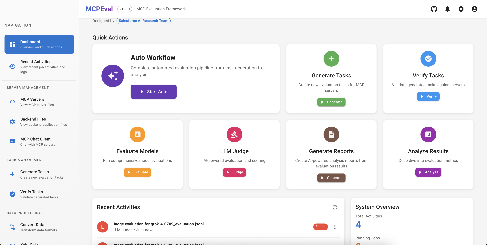

# MCPEval: Automatic MCP-based Deep Evaluation for AI Agent Models

<br/>

<div align="center">

  [](https://arxiv.org/abs/2507.12806)
  [](https://github.com/SalesforceAIResearch/MCPEval/releases)
  
  [](https://github.com/SalesforceAIResearch/MCPEval/blob/main/LICENSE.txt)
  [](https://star-history.com/#SalesforceAIResearch/MCPEval)

</div>

<p align="center">
  <a href="https://arxiv.org/abs/2507.12806">Paper</a> |
  <a href="https://github.com/SalesforceAIResearch/MCPEval#features">Features</a> |
  <a href="https://github.com/SalesforceAIResearch/MCPEval#installation">Installation</a> |
  <a href="https://github.com/SalesforceAIResearch/MCPEval#usage">Usage</a> |
  <a href="https://github.com/SalesforceAIResearch/MCPEval#mcpeval-cli-usage">CLI</a> |
  <a href="https://github.com/SalesforceAIResearch/MCPEval#development">Development</a>
</p>

---

A Model Context Protocol (MCP) based LLM deep evaluation framework.

## Overview

This project provides a framework for evaluating Large Language Models using the [Model Context Protocol](https://github.com/modelcontextprotocol). It enables automating end-
to-end task generation and deep evaluation of LLM agents across diverse dimensions.

## Demo

🎬 **[Watch Full Demo Video (with audio)](https://github.com/SalesforceAIResearch/MCPEval/releases/download/v1.0.0/MCPEval-demo.mp4)**

*Click above to download and view the complete MCPEval demonstration with audio explanation*

## Architecture


*MCPEval system architecture showing the complete evaluation pipeline from task generation to analysis*

## Homepage



*MCPEval web interface providing intuitive access to all evaluation features*

## News
- Supporting GPT-5
- Using model-config for using any model to generate and evaluate
- A new [revalidation cli](src/mcpeval/cli/mcp_task_revalidator/README.md) is released for generating high-quality data

## Features

- 🚀 **Automated End-to-End Evaluation**
- 🔧 **MCP Protocol Integration**
- 📊 **Comprehensive Analysis & Insights**
- 💻 **User-Friendly Web-based Interface**
- ⚡  **Advanced CLI Commands**
- 🔬 **Research & Development Support**

## Citation
If you find our system or paper useful, please cite
```
@misc{liu2025mcpevalautomaticmcpbaseddeep,
      title={MCPEval: Automatic MCP-based Deep Evaluation for AI Agent Models}, 
      author={Zhiwei Liu and Jielin Qiu and Shiyu Wang and Jianguo Zhang and Zuxin Liu and Roshan Ram and Haolin Chen and Weiran Yao and Huan Wang and Shelby Heinecke and Silvio Savarese and Caiming Xiong},
      year={2025},
      eprint={2507.12806},
      archivePrefix={arXiv},
      primaryClass={cs.AI},
      url={https://arxiv.org/abs/2507.12806}, 
}
```

## Installation

### Quick Setup (Recommended)

For complete setup including both CLI and Web UI:

```bash
# Clone the repository
git clone https://github.com/SalesforceAIResearch/MCPEval.git
cd MCPEval

# Run unified setup script (installs CLI, backend API, and frontend UI)
./setup.sh
```

This will set up:
- ✅ Core CLI evaluation framework
- ✅ Flask REST API backend
- ✅ React web interface
- ✅ All dependencies using [uv](https://github.com/astral-sh/uv) package manager

### CLI-Only Setup

For command-line usage only:

```bash
# Make sure uv is installed
curl -LsSf https://astral.sh/uv/install.sh | sh

# Install the package
uv sync
uv sync --extra dev
```

### Environment Configuration

```
cp .env.template .env
```
Edit the `.env` file to add your OpenAI API key:
   ```
   OPENAI_API_KEY=YOUR_OPENAI_API_KEY_HERE
   ```
OR export the key in your terminal:
```
export OPENAI_API_KEY=YOUR_OPENAI_API_KEY_HERE
```

## Usage

### Web Interface (Recommended for New Users)

After running the setup script:

1. **Start the backend API:**
   ```bash
   cd backend
   uv run app.py
   ```
   Backend will run on `http://localhost:22358`

2. **Start the frontend (in a new terminal):**
   ```bash
   cd frontend
   npm start
   ```
   Frontend will run on `http://localhost:22359`

3. **Access the web application:**
   - Open `http://localhost:22359` in your browser
   - Use the intuitive interface to generate tasks, run evaluations, and view results
   - Real-time progress tracking for all operations

**Note:** The frontend automatically proxies API requests to the backend server (port 22358). No additional configuration is needed.

### Command Line Interface

For advanced users and automation:

## Example Usage
We provide an example about a [special calculator MCP application](examples/special_calculator/README.md). We define an example [special calculator MCP server](mcp_servers/special_calculator/server.py) and use [OpenAI client](mcp_clients/example_openai_client/client.py) to interact with the server.

Quick start:
```bash
# Basic example with local MCP server
uv run mcp_clients/example_openai_client/client.py --servers mcp_servers/special_calculator/server.py

# Multiple servers with environment variables (use ^ for env vars)
uv run mcp_clients/example_openai_client/client.py --servers @modelcontextprotocol/server-sequential-thinking mcp-server-nationalparks^NPS_API_KEY=your-api-key-here

# Combined example with arguments and environment variables
uv run mcp_clients/example_openai_client/client.py --servers @openbnb/mcp-server-airbnb:--ignore-robots-txt mcp-server-nationalparks^NPS_API_KEY=your-api-key-here
```

For more details on the OpenAI client usage, see the [OpenAI Client README](mcp_clients/example_openai_client/README.md).

## Available MCP Servers

MCPEval includes a diverse set of MCP servers spanning enterprise domains, public APIs, and computation utilities. Each server exposes tools that LLM agents are evaluated against.

### Self-Contained Servers (No Credentials Required)

These servers are fully deterministic with embedded data or pure computation — ideal for reproducible evaluation.

| Server | Tools | Domain | Description |
|--------|-------|--------|-------------|
| [hr_management](mcp_servers/hr_management/) | 10 | Enterprise | Departments, employees, leave requests, performance reviews, org chart. Embedded SQLite with 70+ rows. |
| [ecommerce](mcp_servers/ecommerce/) | 11 | Enterprise | Products, orders, customers, inventory, sales summaries. Embedded SQLite with 80+ rows. |
| [datetime_tools](mcp_servers/datetime_tools/) | 7 | Utility | Timezone conversion, date difference, business days, holiday support (US/UK/DE/FR/JP). |
| [unit_converter](mcp_servers/unit_converter/) | 6 | Utility | Length, weight, temperature, volume, speed, data size conversion with strict enum schemas. |
| [special_calculator](mcp_servers/special_calculator/) | 4 | Demo | Basic arithmetic with special transformations (add+double, subtract+halve, etc.). |
| [sqlite](mcp_servers/sqlite/) | 8 | Database | General-purpose SQLite operations — create tables, query, insert, with sample datasets. |
| [filesystem](mcp_servers/filesystem/) | 14 | System | Local file operations (read, write, search, directory listing). npm: `@modelcontextprotocol/server-filesystem` |
| [memory](mcp_servers/memory/) | 9 | Knowledge | Knowledge graph with entities, relations, and observations. npm: `@modelcontextprotocol/server-memory` |

### Public API Servers (Free, No Credentials)

| Server | Tools | Domain | Description |
|--------|-------|--------|-------------|
| [book](mcp_servers/book/) | 8 | Library | Open Library search — books by title/ISBN, authors, advanced search. |
| [youtube](mcp_servers/youtube/) | 4 | Media | YouTube transcript extraction, search, and summarization. |
| [healthcare](mcp_servers/healthcare/) | 5 | Medical | FDA drug lookup, PubMed search, clinical trials, ICD-10 codes. |
| [sports](mcp_servers/sports/) | 4 | Sports | NBA, MLB, NFL teams, players, and game data via balldontlie.io. |

### Servers Requiring API Keys

| Server | Tools | Domain | Credentials |
|--------|-------|--------|-------------|
| [travel_assistant](mcp_servers/travel_assistant/) | 6 | Travel | Flights, hotels, restaurants, local events. Requires `SERPAPI_API_KEY`, `YELP_API_KEY`. |
| [airbnb](mcp_servers/airbnb/) | 2 | Travel | Airbnb listing search and details. npm: `@openbnb/mcp-server-airbnb` |
| [yfinance](mcp_servers/yfinance/) | 10 | Finance | Stock prices, financials, options, analyst recommendations via Yahoo Finance. |
| [national_park](mcp_servers/national_park/) | 6 | Parks | U.S. National Parks info, alerts, campgrounds, events. Requires `NPS_API_KEY` (free). |
| [crm_bench](mcp_servers/crm_bench/) | 11 | CRM | Salesforce CRM operations (stub implementation for benchmarking). |

### Multi-Turn Simulation

MCPEval supports multi-turn user simulation where a simulator LLM plays the user role and an agent LLM is tested:

```bash
# Generate scenarios from verified tasks
mcp-eval generate-scenarios \
  --servers mcp_servers/hr_management/server.py \
  --output scenarios.jsonl \
  --num-scenarios 5

# Run multi-turn simulation
mcp-eval simulate \
  --servers mcp_servers/hr_management/server.py \
  --simulator-model-config simulator_model.json \
  --agent-model-config agent_model.json \
  --scenarios-file scenarios.jsonl \
  --output multiturn_results.jsonl

# Evaluate conversations with LLM judge
mcp-eval evaluate-multiturn \
  --input multiturn_results.jsonl \
  --output multiturn_evaluation.jsonl
```

The judge evaluates on 5 dimensions: clarification handling, context maintenance, tool usage efficiency, goal achievement, and response quality.


### Quick Development Setup
```bash
# Complete development environment
./setup.sh

# Start backend API (Terminal 1)
cd backend && uv run app.py

# Start frontend UI (Terminal 2)  
cd frontend && npm start

# Access at http://localhost:22359
```

## Contributing

For each benchmark contribution, please follow the following steps:

1. Create a new directory in the `benchmarks/your_benchmark_name` folder.
2. If you are developing a new MCP server, please create a new folder and add the server script in the `mcp_servers` folder.
3. If you are developing a new MCP client, please create a new folder and add the client script in the `mcp_clients` folder.
4. Add your benchmark scripts to the `benchmarks/your_benchmark_name` folder.

For web interface contributions:
- Frontend components: `frontend/src/components/` and `frontend/src/pages/`
- Backend API endpoints: `backend/app.py`

## Development Roadmap

See our detailed [Development Roadmap](ROADMAP.md) for the current progress and planned features across all components.

## MCPEval CLI Usage

The MCPEval CLI provides a comprehensive toolkit for managing MCP servers and evaluating LLMs. For detailed documentation, parameter descriptions, and advanced usage examples, see the [CLI README](src/mcpeval/cli/README.md).

### Quick Start

**Auto Workflow (Recommended)** - Complete evaluation pipeline in one command:

```bash
# Automatically generate tasks, verify, evaluate, and analyze results
mcp-eval auto \
  --servers @openbnb/mcp-server-airbnb:--ignore-robots-txt \
  --working-dir evaluation_results/airbnb_eval \
  --task-model gpt-4o-2024-11-20 \
  --eval-model-configs benchmarks/airbnb/eval_models/gpt-4o.json \
  --num-tasks 50
```

### Manual Workflow

For more control over each step:

```bash
# 1. Generate tasks
mcp-eval generate-tasks \
  --servers @openbnb/mcp-server-airbnb:--ignore-robots-txt \
  --model-config benchmarks/airbnb/eval_models/gpt-4o.json \
  --num-tasks 200 \
  --output data/airbnb/evaluation_tasks.jsonl

# 2. Verify tasks work correctly
mcp-eval verify-tasks \
  --servers @openbnb/mcp-server-airbnb:--ignore-robots-txt \
  --tasks-file data/airbnb/evaluation_tasks.jsonl \
  --output data/airbnb/evaluation_tasks_verified.jsonl

# 3. Revalidate task descriptions based on execution data (optional but recommended)
mcp-eval revalidate-tasks \
  --verified-tasks-file data/airbnb/evaluation_tasks_verified.jsonl \
  --model-config benchmarks/airbnb/eval_models/gpt-4o.json \
  --output data/airbnb/evaluation_tasks_final.jsonl

# 4. Evaluate model performance
mcp-eval evaluate \
  --servers @openbnb/mcp-server-airbnb:--ignore-robots-txt \
  --model-config benchmarks/airbnb/eval_models/gpt-4o.json \
  --tasks-file data/airbnb/evaluation_tasks_final.jsonl \
  --output benchmarks/airbnb/results/gpt4o_evaluation.json \
  --max-turns 30

# 5. Analyze results and generate reports
mcp-eval analyze \
  --predictions benchmarks/airbnb/results/gpt4o_evaluation.json \
  --ground-truth data/airbnb/evaluation_tasks_final.jsonl \
  --generate-report

# 6. Optional: Run LLM judge evaluation
mcp-eval judge \
  --input-file benchmarks/airbnb/results/gpt4o_evaluation.json \
  --output-dir benchmarks/airbnb/results \
  --model-config benchmarks/airbnb/eval_models/gpt-4o.json

# 7. Optional: Analyze LLM judgment results
mcp-eval judge-rubric \
  --trajectory-file benchmarks/airbnb/results/gpt4o_evaluation_trajectory.json \
  --completion-file benchmarks/airbnb/results/gpt4o_evaluation_completion.json \
  --output-dir benchmarks/airbnb/report
```

**Note**: The revalidation step (step 3) analyzes the actual tool conversations from verified tasks and improves task descriptions to be more accurate and specific. This leads to higher-quality evaluation datasets and better task clarity for subsequent evaluations.

### Available Commands

- `generate-tasks` - Generate evaluation tasks for MCP servers
- `verify-tasks` - Verify tasks can be executed successfully  
- `revalidate-tasks` - Improve task descriptions based on actual execution data
- `evaluate` - Evaluate models using MCP servers and tasks
- `analyze` - Analyze evaluation results and generate reports
- `judge` - Run LLM-based evaluation of execution trajectories
- `judge-rubric` - Analyze LLM judgment results
- `generate-scenarios` - Generate multi-turn scenarios from tasks or servers
- `simulate` - Run multi-turn user simulation conversations
- `evaluate-multiturn` - Evaluate multi-turn conversations with LLM judge
- `convert-data` - Convert data to different formats (e.g., XLAM)
- `auto` - Complete automated evaluation workflow

### Model Configuration

Models are configured using JSON files. Examples:

```json
{
  "model": "gpt-4o-2024-11-20",
  "temperature": 0.01,
  "max_tokens": 16384
}
```

For custom endpoints:
```json
{
  "model": "mistral-24b",
  "api_key": "default",
  "temperature": 0.01,
  "max_tokens": 3000,
  "base_url": "http://<IP_Address>:<port>/v1"
}
```

### Getting Help

```bash
# General help
mcp-eval --help

# Command-specific help
mcp-eval generate-tasks --help
mcp-eval evaluate --help
```

For comprehensive documentation, examples, and advanced usage patterns, see the **[Complete CLI Documentation](src/mcpeval/cli/README.md)**.

## License

This project is licensed under the Apache 2.0 License. See the [LICENSE](LICENSE) file for details.

## Contact

For any questions or feedback, please contact Zhiwei Liu at zhiweiliu@salesforce.com.